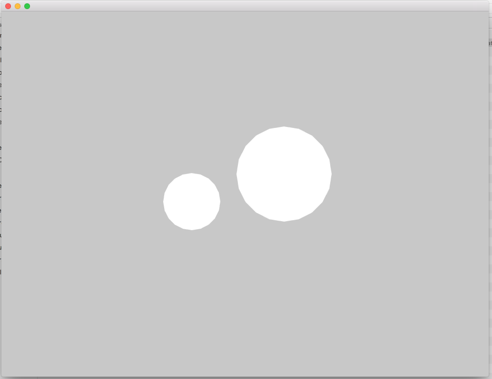
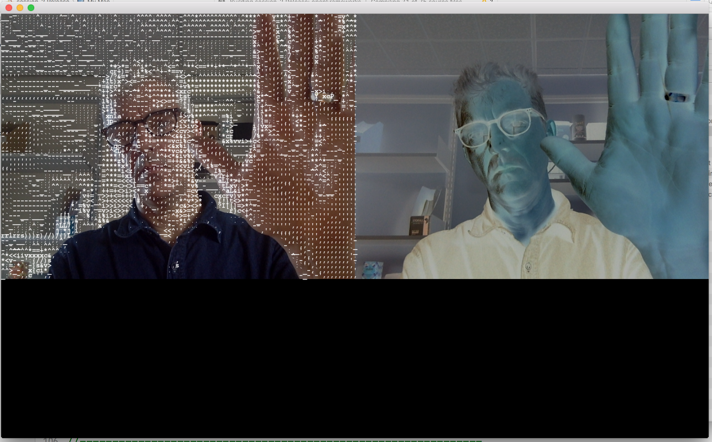
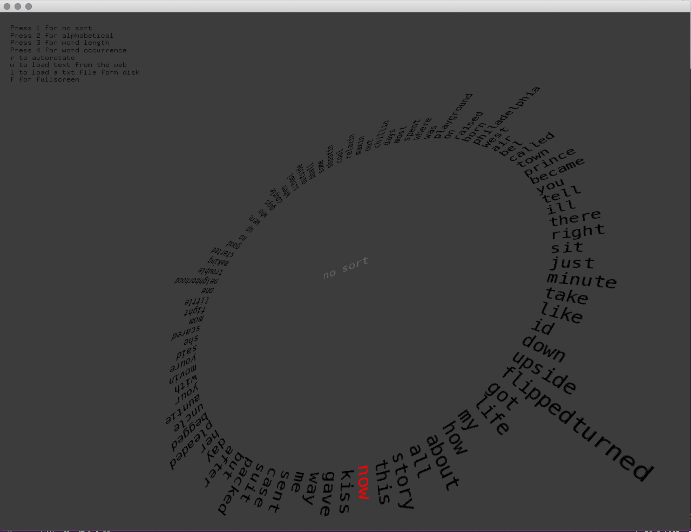
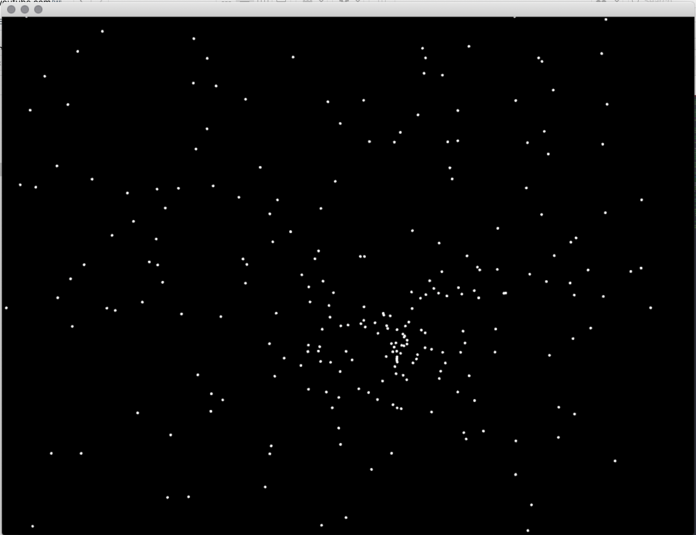
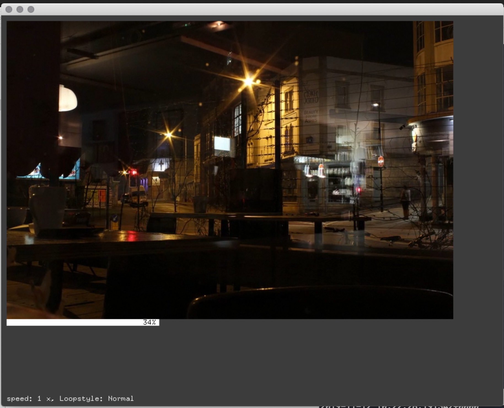

# UWE Bristol Creative Technology Toolkit sessions

example code for the Creative Technology Toolkit module on Creative Technology MSc at UWE Bristol

video walk throughs of all code examples here can be found on YouTube at

https://www.youtube.com/playlist?list=PL6QF0yo3Zj7ALxV4MyOJ9oSFsV-Mo39R2

http://uwecreativetechnology.com

Dan Buzzo, October 2019

updated examples for raspberryPi compatibility // updates for OSX - XCODE11

https://github.com/danbz

https://buzzo.com

With acknowledgement to the work of :
OpenFrameworks Introduction course at ICON http://www.icon-brussels.be/?page_id=1142
and
the 'letsCodeExamples' from Zach Lieberman https://github.com/ofZach

# Session 1 - introduction to OpenFrameworks

• running your first code

• drawing to the screen

• getting input to a system

• using input to modify output

 

# Session 2 - images, video, complex input

• visual sensing

• camera input

• live data translation

• loops

 

# Session 3 - 3D input and 3D output to screen

• introduction to 3D

• 3D primitives, cameras

• sensing in 3D

• reading data from Kinect Sensor

 
 

# Session 4 - introduction to audio in openFrameworks

• audio output

• speech output

 

# Session 5 - introduction to complex transformation

• introduction to text processing

• intelligence and algorithms

 

# Session 6 - thinking about systems and control

• simple algorithms

• drunkards walk 3 ways including Perlin Noise

 

# Session 7 - external input and output with serial

• serial input and output with oF and arduino

• send values to serial port

• retrieve values from serial port

 

# Slit Scan Example

• Simple example to retrieve live image data from a webcam and re-draw a line at a time to the screen

 

# Mesh, noise and perlin noise Example

Simple example to

• generate an openFrameworks (openframeworks.cc) mesh object

• use ofEasyCam to view our 3D scene

• populate it with vertices

• triangulate vertices and add indices to create triangle mesh

• use ofRandom() function to change the vertices z co-ordinates to distort the Mesh

• use 2 dimensional Perlin Noise() function to change the vertices z co-ordinates to distort the Mesh

# Simple Particle Example

• Simple example showing use of a custom 'particle' class 

• generation of our custom particle objects and placement in a vector for drawing and updating

 
# Class Example - using classes in OpenFrameworks

  • writing your first class
  
  • declaring methods and parameters
  
  • drawing to the screen
  
  • making vectors of our custom objects defined by our new class
  
  this example shows a very basic demo of creating and using classes and defining class methods in C++ / openFrameworks

 

# video file playback and control

Simple example to

• use the ofVideoPlayer object to play a video file from disk

• use videoPlayer methods to control looping style and pkayback speed of our video file

• using ofMap to create a playback position indicator bar

• using mousePressed message to create simple clickable interface

 
